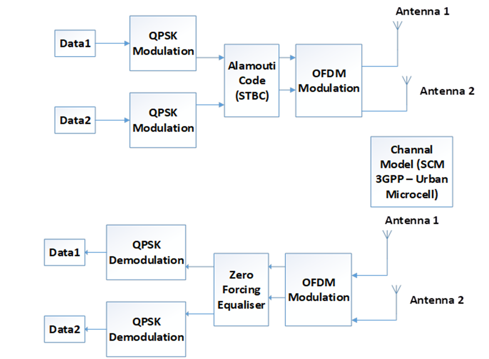
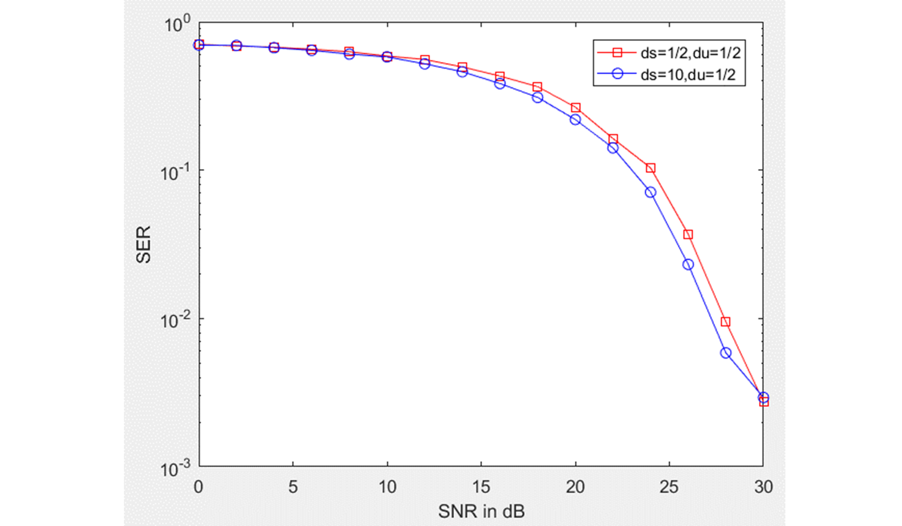

# The performance of space-time block coding (STBC) in non-line-of-sight urban microcell environments using a 2×2 Multiple Input Multiple Output (MIMO) system within the HiperLAN/2 standard. 
In this report, we investigate the performance of space-time block coding (STBC) in non-line-of-sight urban microcell environments using a 2×2 Multiple Input Multiple Output (MIMO) system within the HiperLAN/2 framework. We specifically examine how changing the antenna spacing at the transmitter affects the correlation properties of the Spatial Channel Model (SCM). The SCM, as proposed by the 3rd Generation Partnership Project (3GPP), serves as the channel model for our simulations. Simulation results show that the Symbol Error Rate (SER) performance of STBC with a Zero-Forcing (ZF) equalizer is better than that of Vertical Bell Labs Layered Space-Time (VBLAST) with a Minimum Mean Square Error (MMSE) equalizer. Furthermore, increasing the spacing between transmitter antennas improves system performance.

[1] S. Bernard, "BandPass Modulation and Demodulation," in Digital Communications. Fundamentals and Applications, 2014.

[2] H. Lipfert, " MIMO OFDM Space Time Coding – Spatial Multiplexing, Increasing Performance and Spectral Efficiency in Wireless Systems, Part I Technical Basis," Institut für Rundfunktechnik, 2007.

[3] 3GPP, "3rd Generation Partnership Project; Technical Specification Group Radio Access Network; Spatial channel model for Multiple Input Multiple Output (MIMO) simulations (Release 9)," Valbonne - FRANCE, 2009.

[4] "nutaq," [Online]. Available: https://www.nutaq.com/blog/alamoutispace-time-block-coding. [Accessed 07 04 2019].

[5] N. T. Nga, N. Van Duc, J. Byeungwoo and N. Quy Sy, "An investigation of the spatial correlation influence on coded MIMO-OFDMA system performance," in The 12th International Conference, 2018.
